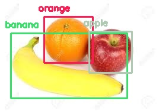

# Dr Foodie (Object detection using deep learning with OpenCV and Python) 

OpenCV `dnn` module supports running inference on pre-trained deep learning models from popular frameworks like Caffe, Torch and TensorFlow. 

 ## YOLO (You Only Look Once)
 
 Download the pre-trained YOLO v3 weights file from this [link](https://pjreddie.com/media/files/yolov3.weights) and place it in the current directory or you can directly download to the current directory in terminal using
 Provided all the files are in the current directory, below command will apply object detection on the input image `fruits.jpg`.
 
 `$ python yolo_opencv.py --image fruits.jpg --config yolov3.cfg --weights yolov3.weights --classes yolov3.txt`
 
 
 **Command format** 
 
 python yolo_opencv.py --image /path/to/input/image --config /path/to/config/file --weights /path/to/weights/file --classes /path/to/classes/file_
 
 As of now this prototype can detect any of the food items among popular fruits(orange, apple, banana), vegetables (carrot, broccoli), fast food(pizza, sandwich) and sweets(cake, donut). With further development this can be upscaled to detect thousands of different kinds of food. Further this displays the result about user's calorie guidance too.
 
 `code.jpg`
 
 ### sample output :
 
 

